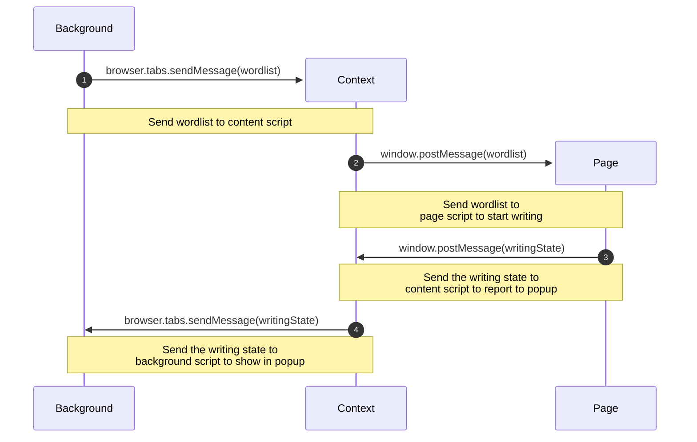

<div>
<p align="center">
  
</p>
<h2 align="center">Eztypr is an "autotyper" for Google Docs.</h3>


  
### Designed to get around <ins>version history review extensions</ins> like [Draftback](https://draftback.com/) by writing as a human would.
### Features:
#### - Static delay per keypress
#### - Adding mistakes to text with intensity slider
#### - Misspelling long words ( > 6 letters )
#### - Adding random delay to each character typed
#### - Text Highlighting to see which words are affected


</div>
<br><br>

> [!IMPORTANT]
> This extension is only available for Firefox.

<div>
  
## Instalation
Download from the Mozilla Addon Page at [Still in the works]()
### Manual/Debug Instalation
- Clone the repository to a local directory `git clone https://github.com/FBIGlowie/eztypr.git`
- Go to your browser's `about:debugging`, check the `This Firefox` button bellow the `Setup` button.
- Scroll down all the way to the **Temporary Extensions** dropdown
- Click `Load Temporary Add-on...`, this will open your systems default file manager.
- Nagivate to the directory you cloned this repository and select the file `manifest.json`
- It should be loaded now
</div>

## How does it work?
### Sending the text

The Background/Popup script itself manages the DOM of the popup, sees what's enabled and updates the highlighting.  Upon clicking the `Start Writing` button, it will create a list of words out of the text to send to the page script.
<br>Why a page script? The dispach event function the extension uses to send keystrokes to the main Google Docs iframe needs to be part of the actuall DOM of the Google Doc instead of being an external "content" script to be able to dispach keystrokes due to world separation of content script. Now the background script cannot directly send object to a page script because of extension isolation. It needs to send a message to a content script first via `browser.tabs.sendMessage()` which will immediatly forward it to the page script via `window.postMessage()`. 
<br>The content script also exists to inject the page script ( as a script element as part of the Docs' page's DOM ) upon the popup opening. The page script will report abck the progress of the writing using the same path but in reverse.
### Injecting keystrokes
Google Docs uses canvas based rendering ( it draw raw to the script ) and uses nested iframes for this. Only one of this iframes actaully accepts keyboard events, which is `.docs-texteventtarget-iframe`.<br>
It will dispach a keydown event, a keypress and a keyup to fully send a key to the doc. There must be a delay in between every press otherwise it doesn't send them in the right order.
```javascript
await dispatchTypeEvent(texteventiframe_window, texteventiframe_doc, "keydown", char);
await dispatchTypeEvent(texteventiframe_window, texteventiframe_doc, "keypress", char);
await dispatchTypeEvent(texteventiframe_window, texteventiframe_doc, "keyup", char);
```

