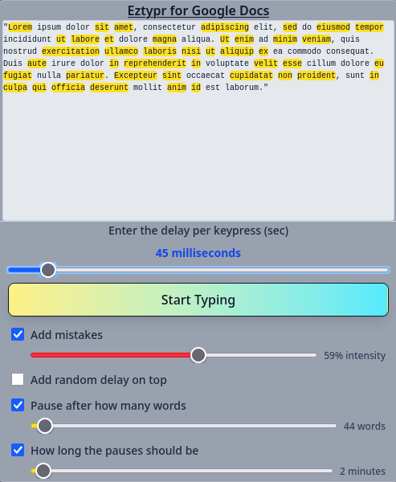

<h2 align="center">Eztypr is an "autotyper" for Google Docs.</h3>

  
### Designed to get around <ins>version history review extensions</ins> like [Draftback](https://draftback.com/) by writing as a human would.
### Features:
#### - Static delay per keypress
#### - Adding mistakes to text with intensity slider
#### - Misspelling long words ( > 6 letters )
#### - Adding random delay to each character typed
#### - Text Highlighting to see which words are affected

 

> [!IMPORTANT]
> This extension is only available for Firefox.

 

  
## Instalation
Download from the Mozilla Addon Page at [Still in the works]()
### Manual/Debug Instalation
- Clone the repository to a local directory `git clone https://github.com/FBIGlowie/eztypr.git`
- Go to your browser's `about:debugging`, check the `This Firefox` button bellow the `Setup` button.
- Scroll down all the way to the **Temporary Extensions** dropdown
- Click `Load Temporary Add-on...`, this will open your systems default file manager.
- Nagivate to the directory you cloned this repository and select the file `manifest.json`
- It should be loaded now

